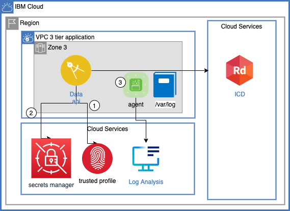

# 3 tier application

| | |
| --- | --- |
| Architecture | [Diagram in draw.io](images/3tier-arch.png) |
| Implementation | https://github.ibm.com/portfolio-solutions/scenario-3tier |
| Implementation Status | :construction: In Progress |
| Implementation Owner | Powell Quiring / [@pquiring on slack](https://github.ibm.com/pquiring/) |
[Implementation](implementation.md)

An iteration of a demo scenario to showcase current state of a three tier application.

## Introduction

This scenario demonstrate the technology investigation phase of a new corporate customer.  "Charles" the CTO asked "Ivan" the Investigator to look into the IBM cloud.  Ivan will determine if IBM is a viable choice.  He has verified that the MZR world wide coverage map meets his world wide coverage requirements.  He will create or port a 3 tier application to VPC instances, distributed over three AZs, using VPC load balancers in a single region. 

Personas:
- Ivan the investigator (focus of this scenario)
- Charles the CTO

Ivan will put together the system using the IBM cloud's features:
- Cloud console to explore, test, learn and verify
- Infrastructure as Code, command line, and python will be used express the three tier prototype.  This will allow changes to be applied during the evaluation period and easily apply changes like Security Group, t-shirt sizes, etc over the entire architecture.
- Postgresql will serve as an example of an open source service that is fully managed (understand integration with IAM, backup/restore, HA, ...)

Infrastructure as a Service (IAAS) networking and compute is expected to perform similar to competition. During the construction Ivan will produce some simple tests to verify the working system and allow changes to be applied.  Platform logging will be enabled and examined

## Architecture


## Implementation

Implementation instructions in [implementation.md](implementtation.md)


### Monitor & Troubleshoot

- Activity Tracker will be validated - is it possible to audit a the final environment (cursory investigation)
- Platform logs might be examined
- Platform metrics might be examined

### IAM

Time constraints will limit the amount of IAM implementation (see "Not in architecture" section above).  But the UI and docs will be studied and verified that it will be possible to separate users and processes to implement principle of least access.

- Execution environment, VSI execution will be enabled using IAM - principle of least access will be applied
- Rotation of statically allocated keys and credentials will be exercised, zero downtime expected (or competition equivalent)

### Automation and IaC

- Terraform provider for prototype closure
- cli access to prototype closure
- Python SDK for some automation will be implemented (other languages are assumed to work similarly)

### Implementation
- Python SDK popular drivers, like psycopg2, will be used.
- Docs, blogs, etc required to implement the prototype will be searched and compared to competition, searches for:
  - (aws, ibm) psycoqg2 initialization
  - aws s3 python, ibm cos python

### Miscellaneous
- Provision performance compared to competitors
- Expense will be compared to competitors - expecting PAYGO

## Design research
Prompt:
1. Implement your version of the architecture diagram using the Cloud console and optionally in terraform.

Offer the following example:
1. Create a Linux based HTTP rest API program in your favorite programming language with a "/" and "/health" API start putting together the diagram
1. Add an "/increment" API call that returns a number that increments a global variable and returns that the number.
1. Add a "/increment" API call to the front end that returns the record from the load balancer of the back end.
1. Add in the Postgresql database and rewrite the "/increment" API call that returns a row in a table and increments a number in that row

 Users should have the following background:
- VPC, instance, load balancer, security group, knowledge for putting together VPC picture
- Linux programming skills for ssh, hello world rest (HTTP) application skills
- Postgresql hello world skills to connect to an IBM Postgresql instance, create table, query data
- Terraform experience

### Missing VPC skills - additional prompts:

Provide hints in order as user gets stuck:
1. Create a VPC and VSI running ibm-ubuntu-20-4-2-min, create the floating ip, ssh to the VSI.
1. Start on create VPC page and make note of subnets
1. Start on the Instances page and create the VSI
1. Navigate from the created instance to the ACL and note the ACL settings for subnet created, wide open, make note to self to make more restrictive later
1. Navigate from the instance to the security group settings, note that inbound port 22 for ssh access.  Also outbound all - required to install software.
1. While at the security group inbound access to any ports required for the application (if using the provided sample app port 8000 will be used)


### Missing Linux programming skills - additional prompts
1. Produce a program that executes on Ubuntu and responds to HTTP requests it should have two three endpoints.  When complete at this stage test it:
```
curl $FIP:8000/
curl $FIP:8000/health
curl $FIP:8000/increment
```
1. For users that can not write a program or have not been successful we can provide instructions for the following program that we provide:
- ssh root@$FIP
- $ apt update -y
- $ apt install python3-pip -y
- $ pip3 install fastapi uvicorn
- $ python3 main.py

Verify it is accessible from your desktop by using the floating ip address using the curl command above.

### Stuck on cloud console load balancer
Successive prompts:
1. Create a load balancer with the front end accessible from the internet on port 8000 (http) and the backend connected to the private IP address of the VSI just created, the application listens on port 8000.
1. Create a backend pool with one member - the local IP address of the vsi created with the health check you just tested. Note the change from floating ip address
1. Create a front end http front end listener on port 8000

### Stuck on terraform
Note: this requires the user to have terraform experience.  An experienced user with strong background in VPC and a desire to learn terraform can also be successful.  Terraform is as difficult to learn as a simple programming language.

creating the full picture: 3 vsis, 3 subnets, security groups, 2 load balancers, etc is a perfect fit for terraform.
Leave the vpc you just created in place for reference.  Create a new copy of the architecture using terraform.  Start with just the VPC, verify it's content in the cloud console and start adding resources incrementally (next is subnets)

Successive prompts:
- Search: `ibmcloud getting started with terraform` should find https://cloud.ibm.com/docs/ibm-cloud-provider-for-terraform?topic=ibm-cloud-provider-for-terraform-getting-started
- Search for: `terraform ibm vpc` Should find `ibm_is_vpc` in the terraform docs.  Start by creating just the vpc.
- Take special note of the `terraform { required_proviers` use the latest version of terraform, 1.0.5, and the latest version of the ibm provider, 1.31.0
- Provide starter tf files for getting the terraform versions correct and for creating a VPC.

# Follow on investigation
The scope of the prototype is one week. The following additional work will be postponed.  Ivan will be thinking ahead and notice any show stoppers but not implement the following:
- Application logging using the cloud logging system
- Application metrics using the cloud metric system
- VPC flow logs to verify and debug
- IaaC service, Schematics
- Image construction automation - stock images with cloud-init user_data for code will be used initially
- COS to store objects but also to understand an example of IBM's born on the cloud best of breed services
- KMS used to encrypt all data at rest
- VPEs to maximize communication privacy
- Backup/restore
- VPN and Direct Link for Ivan to connect for development to replace over internet
- VPN and Direct Link for application users in addition to over internet
- COS bucket for static content
- Team and application based IAM and security separation of concerns
- Multiple VPCs each owned by a single team for additional isolation
- Account separation for team based development and eventually team ownership over production
- Dev, stage, production environments
- Auto scaling
- DNS and CIS custom domain names
- Transit VPC with firewall to control application and data access from on prem, isolation zones, DOS attack, , ...
- Expense tracking, management, predictions, team based reporting, ...
- CI/CD automation

## Next Phase - Instance logging and metrics
1. IBM logging agent is installed.  Ingestion key is provided by terraform constants.
1. IBM Metrics agent is installed.  Ingestion key is provided by terraform constants.

## Next Phase - Flow logs
1. COS instance provision
1. COS bucket 
1. VPC to bucket IAM authorization
1. Flow logs
1. Flow log analysis/visualization 

## Next Phase - Access through Secrets Manager
### Instance Logging


1. IAM Trusted identity for the instance has been initialized and provided access to the secrets manager
1. Secrets manager is accessed to get the log and metrics ingestion keys
1. Secrets manager used to get postgresql connection secrets

## Assessment of next phases and integration
### Services
Each of the services for the scenario will be examined.  Integration points will be investigated.  Expecting no incompatibilities and a lot of consistency allowing me to easily switch between services.

| :arrow_right:&nbsp;Service<br/> :arrow_down:&nbsp;Requirement| Secrets Manager | VPC | Key Protect | IAM | COS | Cloud database for postgresql | Logging | Metrics | Activity Tracker
-|-|-|-|-|-|-|-|-|-
Terraform | ? | ? | ? | ? | ? | ? | ? | ? | ?
SDK | ? | ? | ? | ? | ? | ? | ? | ? | ?
CLI | ? | ? | ? | ? | ? | ? | ? | ? | ?
Activity Tracker | ? | ? | ? | ? | ? | ? | ? | ? | ?
Platform Logs | ? | ? | ? | ? | ? | ? | ? | ? | ?
Platform Monitoring | ? | ? | ? | ? | ? | ? | ? | ? | ?
VPE | ? | ? | ? | ? | ? | ? | ? | ? | ?
Key Protect | ? | ? | ? | ? | ? | ? | ? | ? | ?

### Notes
- application logging ingestion key rotation compared to AWS - downtime required?
- example for each of the components, or a 3 tier app, or lbaas configuration - for prototyping it would be good to find some stuff that overlaps with the scenario.  Close fit is not required - I want to understand all of the technology - make it my own
